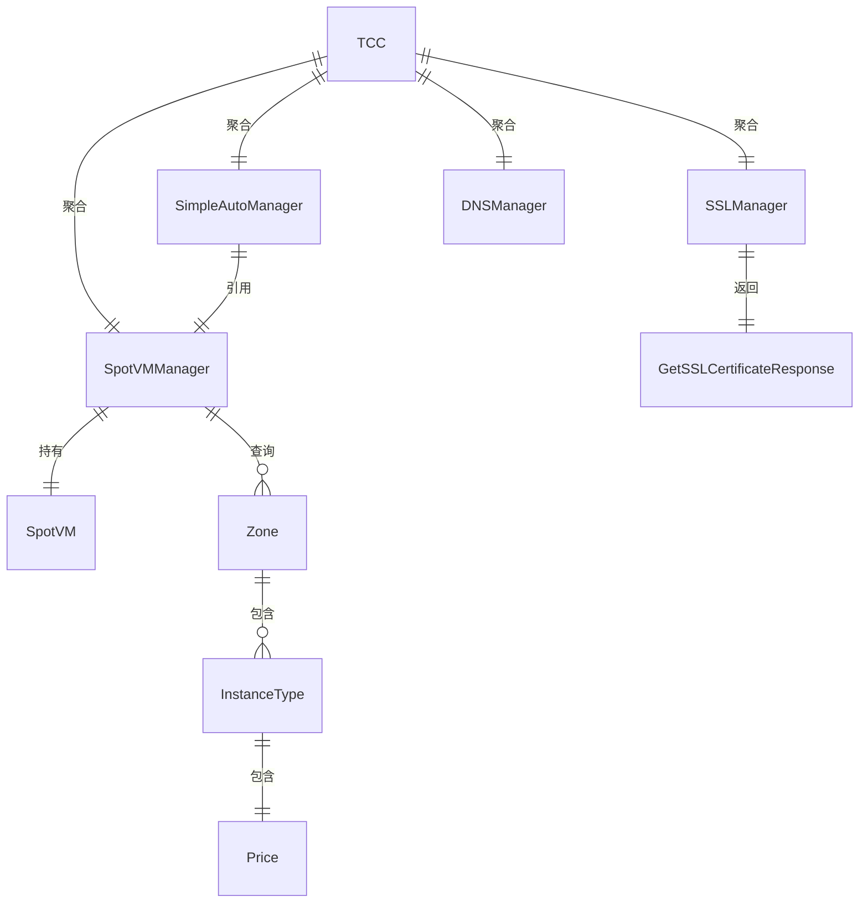

# Data Model: Cloud Spot VM

**Feature**: 001-codebase-logic-spec  
**Date**: 2026-03-31  
**Source**: `internal/models/models.go` + 运行时结构体

## Entity Relationship Diagram



## Entities

### 1. InstanceType（实例类型）

**描述**: 代表一种可售卖的腾讯云 Spot 实例规格  
**来源**: `internal/models/models.go`  
**生命周期**: 查询时创建，不持久化

| Field | Type | Description | Validation |
|-------|------|-------------|------------|
| InstanceType | string | 实例类型标识（如 `S5.SMALL1`） | 非空 |
| InstanceFamily | string | 实例族（如 `S5`） | — |
| TypeName | string | 实例类型名称 | — |
| Cpu | int | CPU 核数 | > 0 |
| Memory | int | 内存大小（MB） | > 0 |
| CpuType | string | CPU 类型 | — |
| Frequency | string | CPU 主频 | — |
| Gpu | int | GPU 数量 | >= 0 |
| GpuCount | int | GPU 卡数 | >= 0 |
| InstanceBandwidth | float64 | 实例带宽 | >= 0 |
| InstancePps | int | 实例包转发量 | >= 0 |
| Status | string | 售卖状态 | `SELL` / `SOLD_OUT` |
| StatusCategory | string | 状态分类 | — |
| Price | Price | 价格信息 | 嵌套对象 |
| Zone | string | 所属可用区（运行时设置） | 非空 |

### 2. Price（价格）

**描述**: 实例类型的价格信息  
**来源**: `internal/models/models.go`  
**嵌套于**: InstanceType

| Field | Type | Description | Validation |
|-------|------|-------------|------------|
| ChargeUnit | string | 计费单位 | — |
| UnitPrice | float64 | 原始单价 | >= 0 |
| UnitPriceDiscount | float64 | 折扣后单价（实际支付价格） | >= 0 |
| Discount | float64 | 折扣率 | 0-100 |

### 3. Zone（可用区）

**描述**: 腾讯云的一个可用区  
**来源**: `internal/models/models.go`  
**生命周期**: 查询时创建，不持久化

| Field | Type | Description | Validation |
|-------|------|-------------|------------|
| Zone | string | 可用区 ID（如 `ap-hongkong-1`） | 非空 |
| ZoneId | string | 可用区数字 ID | — |
| ZoneName | string | 可用区名称 | — |
| ZoneState | string | 可用区状态 | `AVAILABLE` / `UNAVAILABLE` |

### 4. SpotVM（Spot 虚拟机实例状态）

**描述**: 当前运行的 Spot 实例的运行时状态，通过 metadata API 采集  
**来源**: `internal/tcc/spot_vm/vm.go`  
**生命周期**: 程序启动时创建，持续更新，不持久化

| Field | Type | Description | Validation |
|-------|------|-------------|------------|
| InstanceState.PublicIp | *string | 公网 IP | 可为 nil（未获取到） |
| InstanceState.PrivateIp | *string | 私网 IP | 可为 nil |
| InstanceState.InstanceId | *string | 实例 ID | 可为 nil |
| InstanceState.InstanceType | *string | 实例类型 | 可为 nil |
| InstanceState.Zone | *string | 所属可用区 | 可为 nil |

**状态转换**:
```
nil → 已获取（通过 metadata API）
已获取 → 即将回收（termination-time 返回非 404）
```

### 5. SimpleAutoManager（自动管理器状态）

**描述**: 自动管理器的运行时状态  
**来源**: `internal/tcc/spot_vm/simple_auto_manager.go`  
**生命周期**: 程序启动时创建，运行期间持续存在

| Field | Type | Description | Validation |
|-------|------|-------------|------------|
| region | string | 当前 Region | 非空 |
| targetRegion | string | 目标 Region（替换实例创建位置） | 非空 |
| isRunning | bool | 是否正在运行 | — |
| terminationCh | chan struct{} | 终止信号通道（缓冲区=1） | — |
| stopCh | chan struct{} | 停止信号通道 | — |

**状态转换**:
```
已创建 → 运行中（Start()）
运行中 → 已停止（Stop()）
运行中 → 检测到回收（monitorTermination）→ 创建替换实例 → 运行中
```

### 6. GetSSLCertificateResponse（SSL 证书响应）

**描述**: 从腾讯云 SSL 服务获取证书的响应  
**来源**: `internal/models/models.go`

| Field | Type | Description | Validation |
|-------|------|-------------|------------|
| Response.CertificateId | string | 证书 ID | 非空 |
| Response.CertificatePrivateKey | string | 证书私钥（PEM 格式） | 非空 |
| Response.CertificatePublicKey | string | 证书公钥（PEM 格式） | 非空 |
| Response.RequestId | string | 请求 ID | — |

### 7. Config（应用配置）

**描述**: 应用运行时配置，从环境变量加载  
**来源**: `internal/config/config.go`

| Field | Type | Description | Default |
|-------|------|-------------|---------|
| Environment | string | 运行环境 | `"development"` |
| Port | string | 监听端口 | `"8080"` |
| JWTSecret | string | JWT 密钥 | `"your-super-secret-jwt-key-change-in-production"` |
| APIKey | string | API 认证密钥 | `"your-super-secret-api-key-change-in-production"` |
| Region | string | 默认 Region | `""` |
| Domain | string | 域名 | `""` |
| CertificateId | string | SSL 证书 ID | `""` |
| TENCENTCLOUD_SECRET_ID | string | 腾讯云 SecretId | `""` |
| TENCENTCLOUD_SECRET_KEY | string | 腾讯云 SecretKey | `""` |

### 8. TCC（腾讯云客户端聚合）

**描述**: 腾讯云服务的统一入口，聚合所有子管理器  
**来源**: `internal/tcc/tcc.go`

| Field | Type | Description |
|-------|------|-------------|
| Region | string | 当前 Region |
| SpotVMManager | *SpotVMManager | CVM 实例管理器 |
| AutoManager | *SimpleAutoManager | 自动管理器 |
| SSLManager | *SSLManager | SSL 证书管理器 |
| DNSManager | *DNSManager | DNS 记录管理器 |
